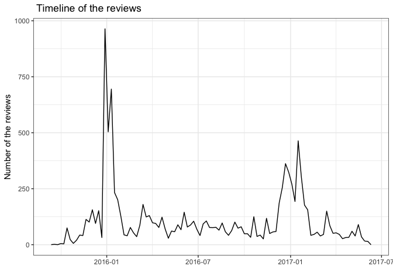
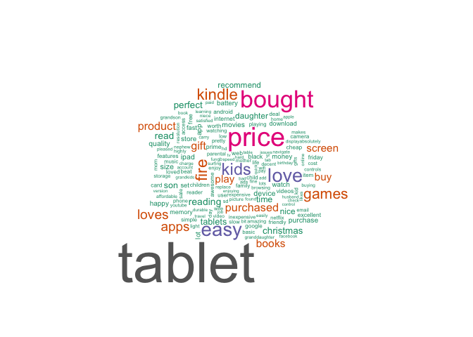
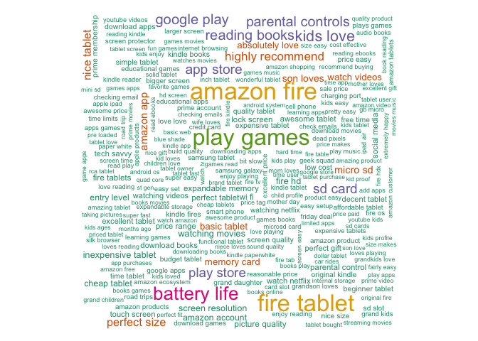
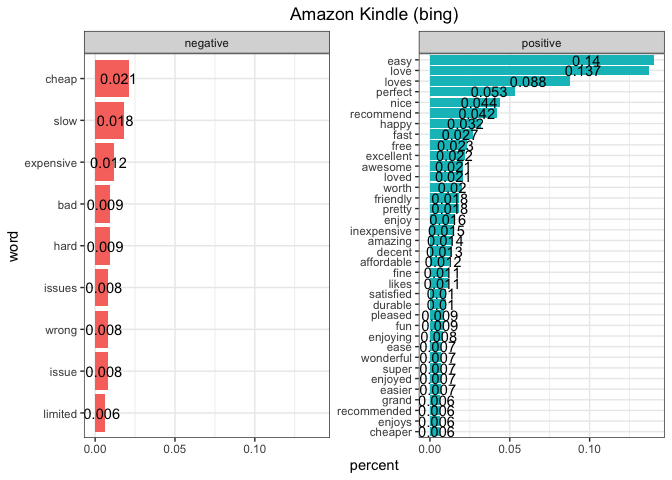
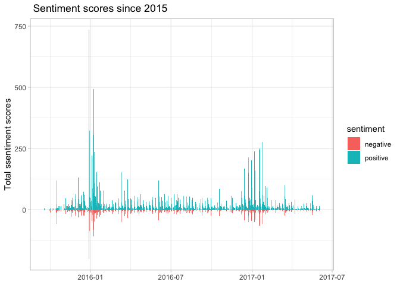
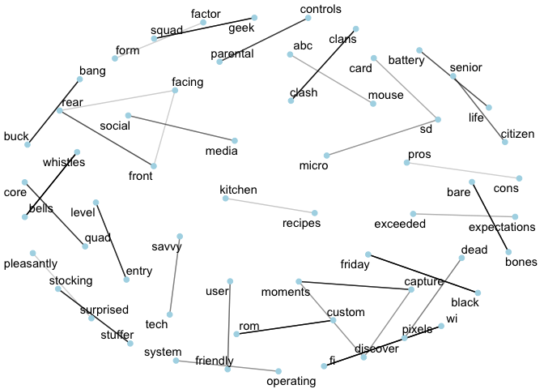
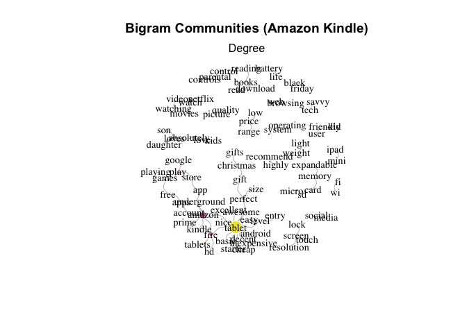
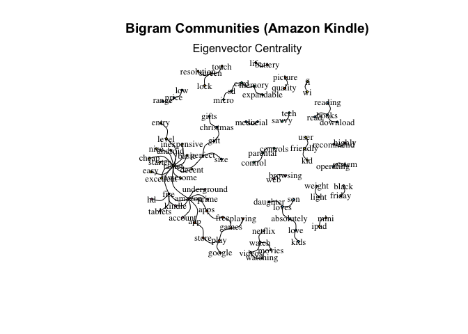
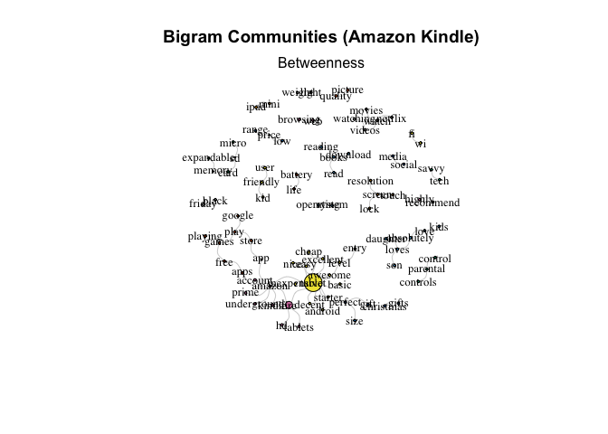

# Data

### required packages


```r
library <- c("tidyverse", "lubridate", "tidytext", "stringi", "ggraph", "igraph",
             "textclean", "widyr", "scales", "mgsub", "wordcloud", "RColorBrewer", "knitr")
sapply(library, require, character.only= TRUE)
```

```
##    tidyverse    lubridate     tidytext      stringi       ggraph       igraph 
##         TRUE         TRUE         TRUE         TRUE         TRUE         TRUE 
##    textclean        widyr       scales        mgsub    wordcloud RColorBrewer 
##         TRUE         TRUE         TRUE         TRUE         TRUE         TRUE 
##        knitr 
##         TRUE
```

The data comes from the kaggle web page, named Consumer Reviews of Amazon [Products](https://www.kaggle.com/datafiniti/consumer-reviews-of-amazon-products). The data consists over 34,000 consumer reviews for Amazon products like the Kindle and Fire TV Stick. It is also available good for classification modeling, such as if you are interested in what features make product suggested. 


```r
# it is from kaggle web page 
amazon <- read.csv("data/1429_1.csv")

table(amazon$id)
```

```
## 
## AV1YE_muvKc47QAVgpwE AV1YnR7wglJLPUi8IJmi AV1YnRtnglJLPUi8IJmV 
##                 5056                  372                 3176 
## AVpe7AsMilAPnD_xQ78G AVpe8PEVilAPnD_xRYIi AVpe9CMS1cnluZ0-aoC5 
##                   19                    1                    5 
## AVpf_4sUilAPnD_xlwYV AVpf_znpilAPnD_xlvAF AVpfBEWcilAPnD_xTGb7 
##                   15                   10                   19 
## AVpff7_VilAPnD_xc1E_ AVpfiBlyLJeJML43-4Tp AVpfIfGA1cnluZ0-emyp 
##                    6                   13                   73 
## AVpfl8cLLJeJML43AE3S AVpfpK8KLJeJML43BCuD AVpftoij1cnluZ0-p5n2 
##                 6619                  636                   51 
## AVpfwS_CLJeJML43DH5w AVpg3q4RLJeJML43TxA_ AVpgdkC8ilAPnD_xsvyi 
##                    4                    6                   10 
## AVpggqsrLJeJML43O5zp AVph0EeEilAPnD_x9myq AVphgVaX1cnluZ0-DR74 
##                    8                    6                10966 
## AVphLY7v1cnluZ0-_Ty0 AVphPmHuilAPnD_x3E5h AVpidLjVilAPnD_xEVpI 
##                   13                  580                  256 
## AVpioXbb1cnluZ0-PImd AVpjEN4jLJeJML43rpUe AVqkEM34QMlgsOJE6e8q 
##                    2                 1038                    1 
## AVqkIdntQMlgsOJE6fuB AVqkIhwDv8e3D1O-lebb AVqkIhxunnc1JgDc3kg_ 
##                   30                 2814                    7 
## AVqkIiKWnnc1JgDc3khH AVqkIj9snnc1JgDc3khU AVqVGWLKnnc1JgDc3jF1 
##                  158                   14                 1685 
## AVqVGWQDv8e3D1O-ldFr AVqVGZN9QMlgsOJE6eUZ AVqVGZNvQMlgsOJE6eUY 
##                  270                    6                  212 
## AVqVGZO3nnc1JgDc3jGK AVsRjfwAU2_QcyX9PHqe AVzoGHhAglJLPUi8GfzY 
##                   67                  402                    7 
## AVzRlorb-jtxr-f3ygvQ AVzvXXwEvKc47QAVfRhx AVzvXXxbvKc47QAVfRhy 
##                   16                    8                    3
```

```r
# AVphgVaX1cnluZ0-DR74 one seems to be the most reviewed product. Let's pick this one

product <- filter(amazon, id =="AVphgVaX1cnluZ0-DR74")

# what we have
glimpse(product)
```

```
## Rows: 10,966
## Columns: 21
## $ id                   <chr> "AVphgVaX1cnluZ0-DR74", "AVphgVaX1cnluZ0-DR74", "…
## $ name                 <chr> "Fire Tablet, 7 Display, Wi-Fi, 8 GB - Includes S…
## $ asins                <chr> "B018Y229OU", "B018Y229OU", "B018Y229OU", "B018Y2…
## $ brand                <chr> "Amazon", "Amazon", "Amazon", "Amazon", "Amazon",…
## $ categories           <chr> "Fire Tablets,Tablets,Computers & Tablets,All Tab…
## $ keys                 <chr> "firetablet7displaywifi8gbincludesspecialoffersma…
## $ manufacturer         <chr> "Amazon", "Amazon", "Amazon", "Amazon", "Amazon",…
## $ reviews.date         <chr> "2016-12-23T00:00:00.000Z", "2016-12-23T00:00:00.…
## $ reviews.dateAdded    <chr> "2017-07-02T18:59:13Z", "2017-07-02T18:59:13Z", "…
## $ reviews.dateSeen     <chr> "2017-06-07T08:20:00.000Z,2017-04-30T00:09:00.000…
## $ reviews.didPurchase  <lgl> NA, NA, NA, NA, NA, NA, NA, NA, NA, NA, NA, NA, N…
## $ reviews.doRecommend  <lgl> TRUE, TRUE, TRUE, TRUE, TRUE, TRUE, TRUE, FALSE, …
## $ reviews.id           <int> NA, NA, NA, NA, NA, NA, NA, NA, NA, NA, NA, NA, N…
## $ reviews.numHelpful   <int> 0, 0, 0, 0, 0, 0, 0, 0, 1, 0, 0, 0, 0, 0, 0, 0, 0…
## $ reviews.rating       <int> 4, 5, 5, 4, 4, 5, 5, 3, 5, 5, 5, 4, 5, 5, 5, 5, 4…
## $ reviews.sourceURLs   <chr> "http://reviews.bestbuy.com/3545/5025800/reviews.…
## $ reviews.text         <chr> "Good basic tablet for checking email , web brows…
## $ reviews.title        <chr> "Good", "Great tablet!", "Good tablet for a low p…
## $ reviews.userCity     <lgl> NA, NA, NA, NA, NA, NA, NA, NA, NA, NA, NA, NA, N…
## $ reviews.userProvince <lgl> NA, NA, NA, NA, NA, NA, NA, NA, NA, NA, NA, NA, N…
## $ reviews.username     <chr> "Jacques", "resolution516", "AvatarRei", "blondia…
```

Among several products, I pick one of them for the sentiment analysis. To do so, first we can check, how many different product reviews exist in the data. There are 42 different products reviewed more than 34.000 times. I picked the most reviewed product here. - AVphgVaX1cnluZ0-DR74 - this product has around 11.000 reviews. 

### Timeline of the reviews


Let's see what is the time frame of these reviews. It seems that most of the reviews were made in 2016. It might be a new product or just the data only consists reviews after 2016. Nevertheless, there might be an upgrade for the product a year later in 2017 because reviews made another peak at that time.  We can make a time related sentiment analysis whether the tone of the sentiment change over time. 


```r
product %>%
        mutate(Date= date(ymd_hms(reviews.date))) %>%
        ggplot(aes(x=Date)) + geom_freqpoly(bins = 100)+
        theme_bw()+
        labs(y= "Number of the reviews",
             x= "",
             title = " Timeline of the reviews")
```

<!-- -->


# Text cleaning

Here I used a similar approach with this [post](https://medium.com/@ozlemuysal/sentiment-analysis-for-product-reviews-using-r-74fc767fb16f) to make market sensitive text preparation. 


```r
reviews.text <- product %>%
  select(reviews.text)

# Encoding
# Check Encoding and Make it consistent
stri_enc_mark(reviews.text$reviews.text)
reviews.text$reviews.text <- sapply(reviews.text$reviews.text,
                                                  function(row) iconv(row,
                                                                      "latin1",
                                                                      "ASCII",
                                                                      sub = " "))
```


```r
# Lowecase all text
reviews.text$reviewText <- tolower(reviews.text$reviews.text)

# make wasn't=was not, can't=can not, etc..
reviews.text$reviews.text <- gsub("wasn[\u2019']t", "was not", reviews.text$reviews.text)
reviews.text$reviews.text <- gsub("won[\u2019']t", "will not", reviews.text$reviews.text)
reviews.text$reviews.text <- gsub("can[\u2019']t", "can not", reviews.text$reviews.text)
reviews.text$reviews.text <- gsub("didn[\u2019']t", "did not", reviews.text$reviews.text)
reviews.text$reviews.text <- gsub("don[\u2019']t", "do not", reviews.text$reviews.text)
reviews.text$reviews.text <- gsub("I[\u2019']m", "I am", reviews.text$reviews.text)
reviews.text$reviews.text <- gsub("[\u2019']ve", " have", reviews.text$reviews.text) 
reviews.text$reviews.text <- gsub("[\u2019|']s", "", reviews.text$reviews.text)
reviews.text$reviews.text <- gsub("[\u2019']re", " are", reviews.text$reviews.text)
reviews.text$reviews.text <- gsub("[\u2019']ll", " will", reviews.text$reviews.text)

# If you view common typos during your analysis, fix them here.
reviews.text$reviews.text<- gsub("canceling", "cancelling", reviews.text$reviews.text)
reviews.text$reviews.text <- gsub("cancellation", "cancelling", reviews.text$reviews.text)

# omit the following two lines if you have not loaded the tm package
# Remove numbers in the text
reviews.text$reviews.text <- tm::removeNumbers(reviews.text$reviews.text)
# Remove punctuations in the text
reviews.text$reviews.textt <- tm::removePunctuation(reviews.text$reviews.text)


# Fix Negations
# Create a list to identify the sentiment shifters in the text
negation.words <- c("not",
                    "no",
                    "without",
                    "never",
                    "bad",
                    "none",
                    "never",
                    "nobody",
                    "nowhere",
                    "neither",
                    "nothing"
)
```


# sentiment analysis


```r
# Run the following to view Shifted sentiments sorted by polarity point
shifted.words <- reviews.text %>%
  unnest_tokens(bigram, reviews.text, token = "ngrams", n = 2)%>%
  count(bigram, sort = TRUE) %>%
  separate(bigram, c("word1", "word2"), sep = " ")%>%
  filter(word1 %in% negation.words & !word2 %in% stop_words$word)%>%
  inner_join(get_sentiments("bing"), by = c(word2 = "word"))%>%
  mutate(sentiment = ifelse(sentiment == "positive", 1, -1)) %>%
  mutate(score = sentiment * n) %>%
  mutate(word2 = reorder(word2, score))

head(shifted.words)
```

```
##   word1      word2  n sentiment score
## 1    no complaints 59        -1   -59
## 2    no     issues 42        -1   -42
## 3   not        bad 27        -1   -27
## 4   not  recommend 19         1    19
## 5   not   complain 18        -1   -18
## 6   not  expensive 13        -1   -13
```


```r
# Pick the most effective sentiment shifters
negated.phrases <- c("not worth", 
                     "not noise",
                     "no issues",
                     "no complaints",
                     "not disappoint",
                     "not disappointed",
                     "not cheap",
                     "no regrets"
                     
)
# Find synonyms for the phrases above to replace
synonyms <- c("expensive",
              "functional",
              "cool",
              "satisfied",
              "satisfied",
              "satisfied",
              "expensive",
              "satisfied"
)


# Replace the negations with their synonyms.
reviews.text <- mgsub(reviews.text$reviews.text, negated.phrases, synonyms) %>%
  dplyr::as_tibble() %>%
  rename(reviews.text = value)
```


# Tokenize and word frequency 

After text cleaning, it is time to see the most frequent words in reviews in the wordcloud.


```r
# if you want to ignore words that are frequent but doesn't help, add them to this list.
ignore.words <- tibble(word = c("amazon"))

# create the words freq table
word.freq.table<- reviews.text %>% 
  unnest_tokens(word, reviews.text) %>%
  anti_join(stop_words) %>%
  anti_join(ignore.words) %>%
  count(word, sort = TRUE)

word.freq.table
```

```
## # A tibble: 6,732 × 2
##    word       n
##    <chr>  <int>
##  1 tablet  5796
##  2 price   2554
##  3 bought  2259
##  4 easy    1758
##  5 love    1724
##  6 kids    1454
##  7 fire    1388
##  8 kindle  1352
##  9 games   1264
## 10 loves   1113
## # … with 6,722 more rows
```

```r
# Plotting a Wordcloud
word.freq.table %>% 
  filter(n>100) %>%
  with(wordcloud(word, n,
                 scale = c(5,0.3),
                 colors = brewer.pal(8, "Dark2")))
```

<!-- -->


Now we can figure out that the reviews were about Amazon Kindle. 

We can also create the wordcloud for the most frequent word-pairs (bigrams).


```r
# Most Common Bigrams
reviews.text %>%
  unnest_tokens(bigram, reviews.text, token = "ngrams", n = 2) %>%
  count(bigram, sort = TRUE) %>%
  separate(bigram, c("word1", "word2"), sep = " ") %>%
  filter(!word1 %in% stop_words$word & !word2 %in% stop_words$word) %>%
  filter(n>7) %>%
  unite(word, word1:word2, sep = " ") %>%
  with(wordcloud(word, n,
                 scale = c(3,0.5),
                 colors = brewer.pal(8, "Dark2")))
```

<!-- -->


We can apply different sentiment dictionaries here. Let's start with Bing dictionary, which basically counts negative and positive word in the text. 


```r
# Most common Positive and Negative words using Bing
reviews.text %>% 
  unnest_tokens(word, reviews.text) %>%
  anti_join(stop_words) %>%
  anti_join(ignore.words) %>%
  inner_join(get_sentiments("bing")) %>%
  count(word, sentiment, sort = TRUE) %>%
  filter(n > 70) %>%
  mutate(word = reorder(word, n)) %>%
  mutate(percent = round(n/sum(n), 3)) %>%
  ggplot(aes(x = word, y = percent, fill = sentiment, label = percent)) +
  geom_col(show.legend = FALSE) +
  facet_wrap(~sentiment, scales = "free_y") +
  geom_text(aes(y = 0.7*percent)) +
  labs(title = "Amazon Kindle (bing)") +
  coord_flip() + 
  theme_bw() +
  theme(plot.title = element_text(hjust = 0.5))
```

<!-- -->

### Sentiment variation during time


```r
product %>% 
        unnest_tokens(word, reviews.text) %>%
        filter(!word %in% stop_words$word) %>%
        select(id, reviews.date, word) %>%
        inner_join(get_sentiments("bing"), by = c("word" = "word")) %>%
        select(id, reviews.date, sentiment ) %>%
        count(id,reviews.date, sentiment) %>%
        mutate(n = ifelse(sentiment == 'negative', -n, n)) %>%
        group_by(Date = as.Date(ymd_hms(reviews.date)), sentiment) %>%
        summarize(total = sum(n)) %>%
        ggplot(aes(x=Date, y=total, fill = sentiment)) + geom_bar(stat='identity') +
        theme_light()+
        labs(title = " Sentiment scores since 2015",
             y= "Total ssentiment scores",
             x= NULL)
```

```
## `summarise()` has grouped output by 'Date'. You can override using the `.groups` argument.
```

<!-- -->

It seems that people have positive emotion for Amazon Kindle and it does not change overtime. 

# Correlation

The following graph shows the correlation of words that appears together in a user review. If the line is bolder that the correlation is higher


```r
# Bing
bing.mean.score <- word.freq.table %>% 
  inner_join(get_sentiments("bing")) %>%
  mutate(sentiment = ifelse(sentiment == "positive", 1, -1)) %>%
  summarise(mean = mean(sentiment))
```

```
## Joining, by = "word"
```

```r
# rescale the range to 5 star range.
bing.mean.score<-rescale(bing.mean.score$mean, to = c(1,5), from = c(-1,1))
  

# Afinn scores are from -5 to 5.
afinn.mean.score <- word.freq.table %>% 
  inner_join(get_sentiments("afinn"))%>%
  summarise(mean = mean(value))
```

```
## Joining, by = "word"
```

```r
# rescale the range to 5 star range.
afinn.mean.score<-rescale(afinn.mean.score$mean, to = c(1,5), from = c(-5,5))
```


```r
# Correlation Terms
# The correlation of appearing together in a review
correlation.terms <-reviews.text %>%
  mutate(review = row_number()) %>%
  unnest_tokens(word, reviews.text) %>%
  filter(!word %in% stop_words$word) %>%
  group_by(word) %>%
  filter(n() >= 5)%>%
  pairwise_cor(word, review, sort = TRUE)

correlation.terms
```

```
## # A tibble: 2,946,372 × 3
##    item1    item2    correlation
##    <chr>    <chr>          <dbl>
##  1 whistles bells          1    
##  2 bells    whistles       1    
##  3 fi       wi             0.987
##  4 wi       fi             0.987
##  5 friday   black          0.950
##  6 black    friday         0.950
##  7 rom      custom         0.894
##  8 custom   rom            0.894
##  9 bones    bare           0.894
## 10 bare     bones          0.894
## # … with 2,946,362 more rows
```

```r
correlation.terms %>%
  filter(correlation >= 0.50) %>%
  graph_from_data_frame() %>%
  ggraph(layout = "igraph", algorithm = "kk") +
  geom_edge_link(aes(alpha = correlation), 
                 show.legend = FALSE)+
  geom_node_point(color = "lightblue", size = 2) +
  geom_node_text(aes(label = name), repel = TRUE) +
  theme_void()
```

<!-- -->


# bigram network


```r
bigrams.network.df<-reviews.text %>%
  unnest_tokens(bigram, reviews.text, token = "ngrams", n = 2) %>%
  separate(bigram, c("word1", "word2"), sep = " ") %>%
  filter(!word1 %in% stop_words$word & !word2 %in% stop_words$word) %>%
  count(word1, word2, sort = TRUE) %>%
  filter(n > 30)

bigrams.network <- graph_from_data_frame(bigrams.network.df)
```


# calculating centriality 


```r
# now we find the centrality measures of the network
# degree:the number of its adjacent edges (measure of direct influence)
deg <- degree(bigrams.network, mode = "all")

#K-core decomposition allows us to identify the core and the periphery of the network. A k-core is a maximal subnet of a network such that all nodes have at least degree K.
core <- coreness(bigrams.network, mode = "all")

# betweenness measures brokerage or gatekeeping potential. It is (approximately) the number of shortest paths between nodes that pass through a particular node.
betw <- betweenness(bigrams.network)

#Eigenvector centrality is a measure of being well-connected connected to the well-connected. First eigenvector of the graph adjacency matrix. Only works with undirected networks.
eigen <- eigen_centrality(bigrams.network, directed = TRUE)
```

```
## Warning in eigen_centrality(bigrams.network, directed = TRUE): At
## centrality.c:333 :graph is directed and acyclic; eigenvector centralities will
## be zeros
```

```r
members <- cluster_walktrap(bigrams.network)

bigrams.network <- simplify(bigrams.network, 
                            remove.multiple = FALSE,
                            remove.loops = TRUE)
V(bigrams.network)$color <- members$membership+1
```


### Degree


```r
# Using "Degree" as size
# degree=mode (number of edges of the node, in-degree:prestige

plot(bigrams.network,
     layout = layout_with_fr,
     vertex.label.color = "black",
     vertex.label.cex = 0.9,
     vertex.label.dist = 0,
     vertex.frame.color = 0,
     vertex.size = deg, 
     edge.arrow.size = 0.01,
     edge.curved = 0.7,
     edge.color = "gray",
     main = "Bigram Communities (Amazon Kindle)"
)
mtext("Degree")
```

<!-- -->

### Eigenvector Centrality


```r
# Using "Eigenvector Centrality" as size
# centrality (the most connected words)
plot(bigrams.network,
     layout = layout_with_fr,
     vertex.label.color = "black",
     vertex.label.cex = 0.8,
     vertex.label.dist = 0,
     vertex.size = eigen$vector*20, 
     edge.arrow.size = 0.01,
     edge.curved = 0.7,
     edge.color = "black",
     main = "Bigram Communities (Amazon Kindle)"
)
mtext("Eigenvector Centrality")
```

<!-- -->

### Betweenness 


```r
# Using "Betweenness" as size
# Betweenness -> median (weighted # of paths going through the node)
plot(bigrams.network,
     layout = layout_with_fr,
     vertex.label.color = "black",
     vertex.label.cex = 0.8,
     vertex.label.dist = 0,
     vertex.size = betw, 
     edge.arrow.size = 0.01,
     edge.curved = 0.7,
     edge.color = "lightgrey",
     main = "Bigram Communities (Amazon Kindle)"
)
mtext("Betweenness")
```

<!-- -->


